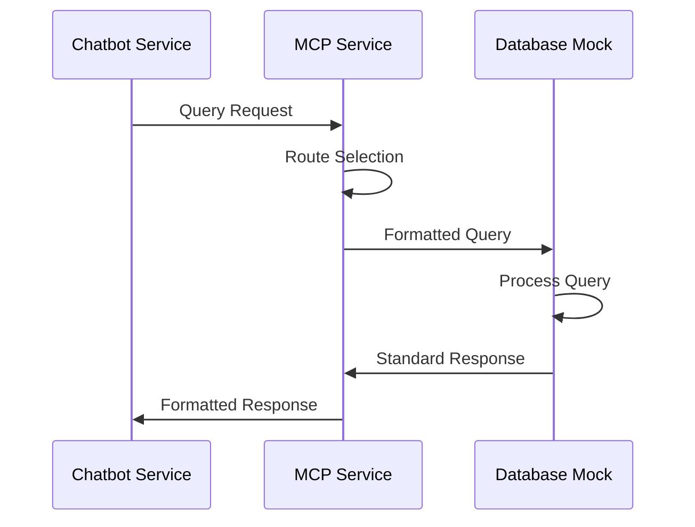

# Tri-Database Chatbot V1

A foundational infrastructure for a multi-purpose chatbot system with intent-based routing and mock database integrations.This project implements a skeletal blueprint for an advanced chat bot system which connects to 3 types of database in order to effectively handle all kinds of complex business transactions. It uses a Kubernetes architecture and will eventually support containerized databases implemented in Rust.

## Table of Contents

1. [Project Overview](#1-project-overview)
2. [System Architecture](#2-system-architecture)
3. [Database Mocks Architecture](#3-database-mocks-architecture)
4. [Mock Database Integration](#4-mock-database-integration)
5. [Implementation Details](#5-implementation-details)
6. [Development Guidelines](#6-development-guidelines)
7. [Development Setup](#7-development-setup)
8. [Testing Framework and Results](#8-testing-framework-and-results)
9. [Known Limitations](#9-known-limitations)
10. [Troubleshooting Guide](#10-troubleshooting-guide)

## 1. Project Overview

This project implements a skeletal blueprint for a chatbot system, focusing on establishing foundational "utility lines" of connectivity using Python-based service foundations and Test-Driven Development (TDD).

### Core Features

- Intent-based query routing
- Multiple mock database integrations
- Asynchronous request handling
- Health monitoring system
- Test-driven development approach

## 3. Database Mocks Architecture

### Neo4j Mock (Port 8002)

The Neo4j mock implements a graph database simulation using NetworkX, providing a lightweight alternative to a full Neo4j instance while maintaining essential functionality.

#### Architecture Components

- **NetworkX-based Graph Engine**
  - In-memory graph structure
  - Basic CRUD operations for nodes and relationships
  - Support for simple graph traversal operations
  - Property storage on nodes and edges

#### Query Interface

- **Cypher-like Query Parser**
  - Support for basic MATCH, CREATE, SET operations
  - Pattern matching functionality
  - Property filtering
  - Result formatting matching Neo4j's response structure

#### Core Capabilities

```python
# Example Query Support
CREATE (n:Person {name: 'John'})
MATCH (n:Person) WHERE n.name = 'John' RETURN n
MATCH (n)-[r:KNOWS]->(m) RETURN n, r, m
```

### Weaviate Mock (Port 8003)

The Weaviate mock simulates vector search operations using NumPy, providing efficient similarity search capabilities without requiring a full Weaviate installation.

#### Architecture Components

- **NumPy Vector Operations**
  - Vector storage and manipulation
  - Cosine similarity calculations
  - KNN search implementation
  - Efficient batch operations

#### Core Features

- **Vector Search Engine**
  - Vector embedding storage
  - Similarity search operations
  - Basic filtering capabilities
  - Result ranking and scoring

#### Performance Optimization

- In-memory vector storage
- Batch processing support
- Indexed similarity calculations
- Optimized NumPy operations

### Relational Mock (Port 8004)

The relational database mock leverages SQLAlchemy Core for SQL operations, providing a robust foundation for relational data operations.

#### Architecture Components

- **SQLAlchemy Core Implementation**
  - Table definitions using SQLAlchemy models
  - Transaction management
  - Connection pooling
  - Query builder interface

#### Schema Management

- **Alembic Integration**
  - Version-controlled schema changes
  - Migration scripts
  - Schema rollback capability
  - Database initialization scripts

#### Core Features

- **Query Processing**
  - CRUD operations
  - Transaction support
  - Join operations
  - Aggregation functions

## 4. Mock Database Integration

### Connection Patterns with MCP



#### Query Routing Implementation

- Intent-based routing logic
- Database selection criteria
- Load balancing considerations
- Failover handling

#### Response Format Standardization

```json
{
  "status": "success",
  "data": {
    "result": [
      /* database-specific result */
    ],
    "metadata": {
      "db_type": "neo4j|weaviate|relational",
      "query_time": "0.123s",
      "node_count": 10
    }
  }
}
```

#### Error Handling Approaches

- Connection failures
- Query timeout handling
- Invalid query detection
- Resource exhaustion handling

### Performance Considerations

- Connection pooling
- Query optimization
- Caching strategies
- Resource management

## 5. Implementation Details

### Code Structure

```
mock_services/
├── neo4j_mock/
│   ├── graph_engine.py
│   ├── query_parser.py
│   └── response_formatter.py
├── weaviate_mock/
│   ├── vector_store.py
│   ├── similarity_engine.py
│   └── result_ranker.py
└── relational_mock/
    ├── schema.py
    ├── migrations/
    └── query_builder.py
```

### Interface Contracts

- Standardized API endpoints
- Request/response schemas
- Error reporting format
- Health check interfaces

### Test Coverage Details

- Unit test organization
- Integration test suites
- Performance benchmarks
- Coverage requirements

### Mock Data Management

- Data generation strategies
- Seeding mechanisms
- Data consistency rules
- Reset capabilities

## 6. Development Guidelines

### Local Setup Instructions

1. Clone the repository
2. Install dependencies
3. Configure environment
4. Initialize mock databases

### Testing Procedures

1. Unit testing guidelines
2. Integration testing process
3. Performance testing
4. Coverage reporting

### Common Troubleshooting

- Database connection issues
- Query parsing errors
- Performance bottlenecks
- Environment setup problems

### Extension Points

- Custom query handlers
- New database mock integration
- Enhanced routing logic
- Advanced features
