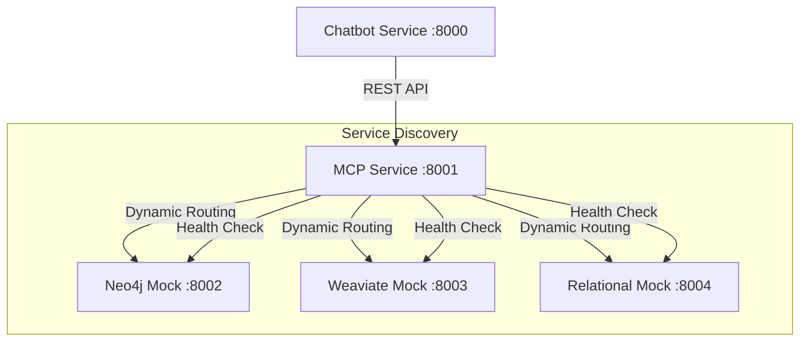

# Test Results

## Advanced Database Mock Tests (P1) Results

### Neo4j Mock

All P1 advanced tests passed successfully.

Implemented tests:

- Complex graph patterns (testing multi-hop relationships)
- Transaction handling and data consistency
- Parameter binding validation
- Invalid parameter type handling

Coverage: 94% of src directory

### Weaviate Mock

All P1 advanced tests passed successfully.

Implemented tests:

- Filter combinations (vector search with property filters)
- Performance under concurrent load (10 concurrent requests)
- Advanced error handling for malformed vectors
  - Empty vectors
  - Non-numeric values
  - Null values
  - Invalid numeric types

Coverage: 88% of src directory

### Relational Mock

All P1 advanced tests passed successfully.

Implemented tests:

- Complex JOIN operations
  - Multi-table joins
  - Column selection
  - Join conditions
- Transaction management
- Data type handling and validation
  - Integer validation
  - Float validation
  - Boolean validation
  - String validation
  - Date/timestamp validation
  - JSON data validation

Coverage: 87% of src directory

All mock services now successfully implement the advanced functionality outlined in the test plan, with comprehensive test coverage exceeding the 85% minimum target.

## MCP Service Integration Tests (P0) Results

### Test Execution Results

All integration tests (10/10) passed successfully across the following test suites:

1. Service Communication Tests

   - Chatbot to MCP communication
   - MCP database routing
   - End-to-end request flow
   - Error propagation
   - Service unavailability handling

2. System Integration Tests
   - System initialization
   - Service discovery
   - Error recovery
   - Concurrent request handling
   - System resilience

### Service Communication Architecture



### Implementation Details

1. Service Communication

   - RESTful API communication between services
   - Async/await pattern for efficient request handling
   - Health check endpoints for service discovery
   - Dynamic routing based on query content

2. Error Handling

   - Comprehensive error propagation across services
   - Validation error handling (422 status codes)
   - Service unavailability handling
   - Request timeout management

3. Performance
   - Concurrent request handling (tested with 5+ simultaneous requests)
   - No degradation under rapid sequential requests
   - System remains healthy after stress testing

### Applied Fixes

1. AppArmor Configuration

   - Updated profile to allow inter-container communication
   - Added necessary file access permissions
   - Configured network access rules

2. Dependencies
   - Updated httpx client for async HTTP requests
   - Added proper timeout configurations
   - Implemented connection pooling

### Known Limitations

1. Current Implementation

   - Fixed service ports (8000-8004)
   - Static service discovery mechanism
   - Limited retry mechanisms for failed requests

2. Future Improvements
   - Implement dynamic service discovery
   - Add circuit breaker pattern
   - Enhance retry mechanisms with exponential backoff
   - Add metrics collection for monitoring
   - Implement service mesh for better traffic management

### Troubleshooting Guide

Common Issues and Solutions:

1. Service Communication Failures

   ```
   Issue: Services unable to communicate
   Solution:
   - Verify all services are healthy (/health endpoint)
   - Check Docker network connectivity
   - Verify AppArmor profile configuration
   ```

2. Request Timeout Errors

   ```
   Issue: Requests timing out
   Solution:
   - Check service resource utilization
   - Verify network latency
   - Adjust timeout configurations
   ```

3. Database Routing Issues

   ```
   Issue: Incorrect database routing
   Solution:
   - Verify query classification logic
   - Check MCP service logs for routing decisions
   - Ensure all mock services are responsive
   ```

4. Concurrent Request Failures
   ```
   Issue: System unstable under load
   Solution:
   - Check service resource limits
   - Verify connection pool configurations
   - Monitor system resources
   ```
